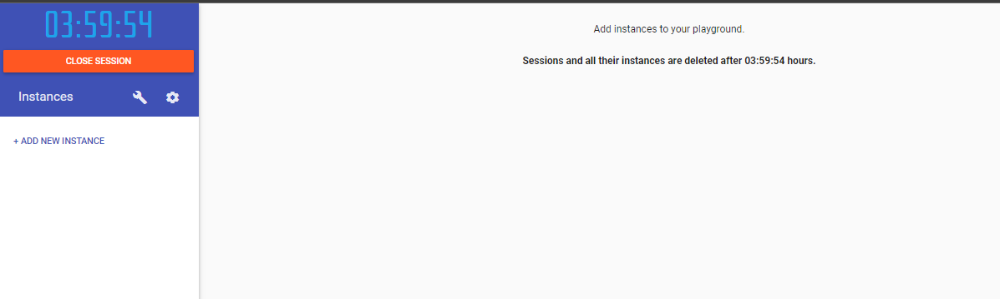
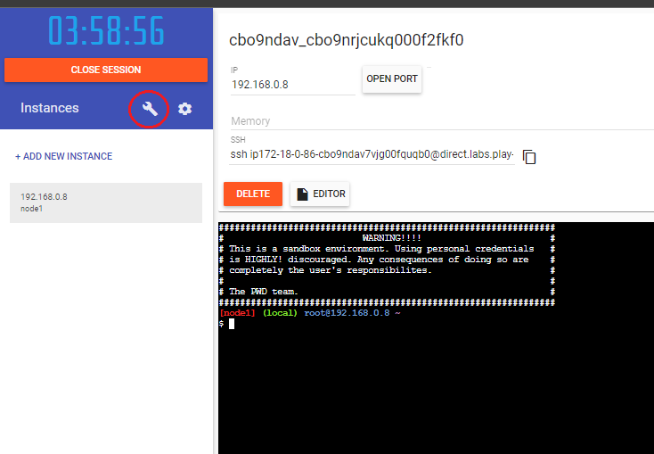
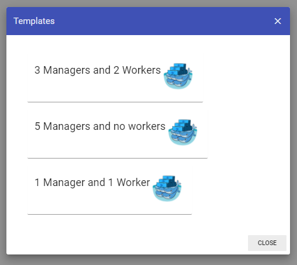

# 🚢 Create New Instance

Start လုပ်လိုက်ပြီး Playground ထဲကို ရောက်သွားပြီ ဆိုတာနဲ့ ပုံ ထဲက အတိုင်းမြင်ရမှာပါ။ အဲ့ဒီမှာ ကျွန်တော် တို့ က အောက်က ADD NEW INSTANCE ကို Click ပြီးတော့ Instance တစ်လုံးကို စတင် run လို့ရပါပြီ။ Session တစ်ခုကို ၄နာရီ သတ်မှတ်ထားပြီးတော့ အချိန်ပြည့်တာနဲ့ Session ပြန် Start လုပ်ပြိး ပြန်စမ်းလို့ ရပါတယ်။

Running Instance တစ်လုံးမှာ ဘာတွေရှိမလဲကြည့်မယ်ဆိုရင်\
\- အပေါ်ဆုံးမှာ instance ID တစ်ခု ပါမယ် \
\- 192 နဲ့ စတဲ့ private ip address တစ်ခုပါမယ် \
\- SSH ဝင်လို့ရမယ့် Address တစ်ခုပါမယ် \
\- Editor ဆိုတဲ့ file တွေ create / upload လုပ်လို့ရမယ့် Button လေး တစ်ခု ပါမယ် အစရှိသဖြင့် တွေ့ ရမှာပါ&#x20;

<mark style="color:blue;background-color:red;">CLOSE SESSION</mark> ဆိုတဲ့ အောက်က ဝိုင်းပြထားပေးတဲ့နေရာ ကို Click လိုက်မယ်ဆိုရင် အဆင်သင့်အသုံးပြုလို့ရမယ် Templates တွေ ကျလာမှာပါ။

