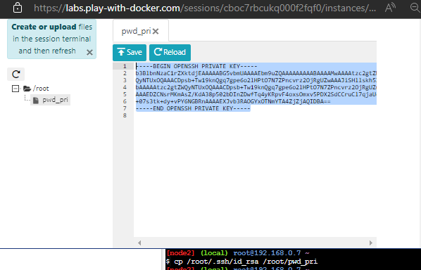
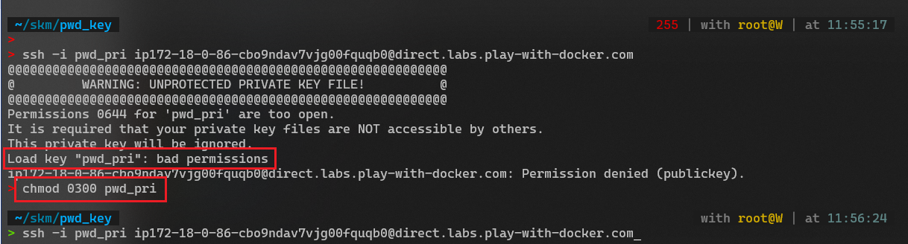
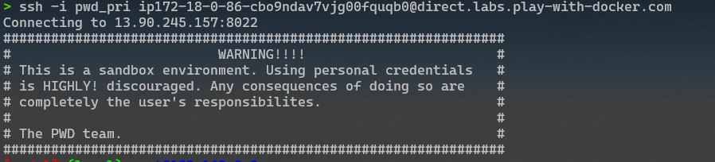

# 🐧 How to Connect SSH to PWD Running Instance

PWD မှာရှိတဲ့ running instance ကို SSH ဝင်ဖို့အတွက် running Instance ထဲမှာ ရှိတဲ့ generate လုပ်ပြီးသား SSH rsa private key ကို အရင်ဆုံး ကူးယူဖို့လိုအပ်ပါတယ်။

SSH private key ဘယ်မှာ ရှိလဲ ကြည့်ကြရအောင်\
ကျွန်တော်တို့က လက်ရှိ root အကောင့်ရဲ့ Home Directory (\~) ဖြစ်တဲ့ /root/ ထဲကို ရောက်နေတာပါ။ ဒီထဲမှာပဲ .ssh ဆိုတဲ့ directory တစ်ခုရှိပါတယ်။ .ssh ဆိုတဲ့ Directory အောက်ထဲကို ထပ်ဝင်ကြည့်လိုက်မယ်ဆိုရင် rsa key လေးတွေကိုတွေ့ရမှာပါ။

```
> ls -alh /root/.ssh
```

id\_rsa ဆိုတဲ့ private key file လေးကိုတွေ့ရမှာပါ ။ File Permission လေး တွေကို ဂရုပြုပါ။

.png>)

ဒီ key လေး ကို  Home Directory ဖြစ်တဲ့ /root/ အောက်ကို Copy ကူးထုတ်လိုက်ပါမယ် ကျွန်တော်ကတော့ pwd\_pri ဆိုတဲ့နာမည်နဲ့ copy လိုက်ပါမယ်&#x20;

```
> cp /root/.ssh/id_rsa /root/pwd_pri
```



ပြီးရင်တော့ <mark style="background-color:yellow;">EDITOR</mark> ဆိုတဲ့ button လေးကို Click လိုက်ပါ ပုံမှာပြထားတဲ့အတိုင်း SSH private key file လေးကိုတွေ့ ရမှာပါ။ ဒီ key လေးကို ကျွန်တော် တို့ ssh ဝင်မယ့် နေရာမှာ အသုံးပြုလို့ ရပါပြီ ။ ကျွန်တော်က တော့ Windows မှာ [<mark style="color:yellow;"><mark style="color:green;">WSL<mark style="color:green;"></mark>](https://docs.microsoft.com/en-us/windows/wsl/) <mark style="color:yellow;"></mark> ထည့်ထားတာဖြစ်လို့ [Windows Terminal](https://github.com/microsoft/terminal) ကို ဖွင့် ပြီး [WSL](https://docs.microsoft.com/en-us/windows/wsl/) ကနေ တဆင့် ဝင်မှာပါ ။ အဲ့ တော့ ကျွန်တော် ဒီ Key လေးကို copy ကူးပြီး ssh private key file လေး အဖြစ် ဖန်တီးမှာပါ vi ဆိုတဲ့ cli text editor လေးကိုအသုံးပြုပြီး အခု ဏ key လေးကို paste ချ <mark style="background-color:green;">ESC :wq</mark> နဲ့ save လိုက်ပါပြီ။

private key file လေးရပြီ ဆိုတော့  ssh -i လေးနဲ့ ဝင်လိုက်လို့ ရပါပြီ။ ကျွန်တော့် private key filename လေးက pwd\_pri နာမည် နဲ့ သိမ်းထားတာဖြစ်လို့ အဲ့တာလေးကိုအသုံးပြုပြီး ဝင်လိုက်ပါမယ်

<pre><code><strong>> ssh -i &#x3C;privatekey_filename> &#x3C;ssh_remote_address></strong></code></pre>



ဝင်လိုက်ပြီ ဆိုတာ နဲ့ Error က စတက်ပါပြီ ပြဿနာက File permission  ကြောင့်ပါ ကျွန်တော်တို့အပေါ်မှာကြည့်ခဲ့ တဲ့ id\_rsa ဆိုတဲ့ မူရင်း File ရဲ့  Permission အတိုင်းပေးရမှာပါ။

```
> chmod 0300 pwd_key
```

permission ပေးပြီးပြီ ဆိုတာ နဲ့ ပြန်ဝင် ကြည့်လိုက်ပါ။



အဆင်ပြေပြေနဲ့ Play with Docker မှာ ရှိတဲ့ running Instance တစ်လုံးဆီကို ssh နဲ့ အလွယ်တကူ ဝင်ရောက် စမ်းသပ်လို့ ရသွားပါပြီ ။&#x20;

## <mark style="color:yellow;">**Thank you for your attention.**</mark>
