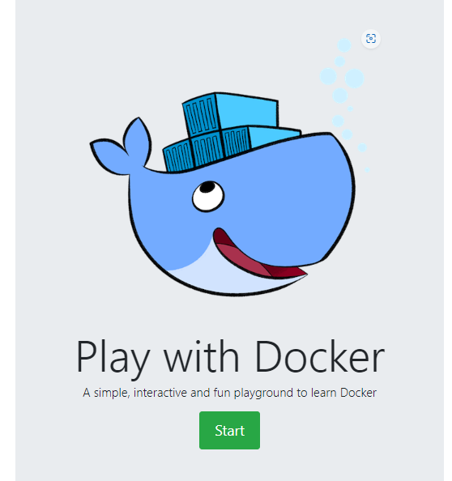

# 📘 What is PWD? Play with Docker

## Play with Docker ဆိုတာ ဘာလဲ ?

PWD ဆိုတာကတော့ အရိုးရှင်းဆုံး ပြောရရင် Docker Labs တွေ စမ်းဖို့အတွက် resource တွေ free ရနိုင်တဲ့ Playground တစ်ခုပဲဖြစ်ပါတယ်။ ကျွန်တော် တို့တွေ Containerization Technologies တွေကို လေ့လာ တဲ့ နေရာမှာ Docker ဆိုတာကတော့ မသိမဖြစ်သိထားရမယ် Container Engine တစ်ခုပဲဖြစ်ပါတယ်။ Docker ကို ကျွန်တော်တို့ကိုယ်ပိုင် Computer လေးတွေပေါ်မှာ run မယ် စမ်းမယ် ဆိုရင် သင့်တင့် တဲ့ Specifications ရှိဖို့တော့လိုအပ်ပါတယ် ။  Computer  Specifications အရမ်နိမ့်ပြီး  Resources တွေ မလုံလောက်တဲ့အခါမှာ  ဒီ PWD လေးက  Docker Labs တွေစမ်းဖို့အတွက် အများကြီးအထောက်အကူဖြစ်စေမှာပါ။

